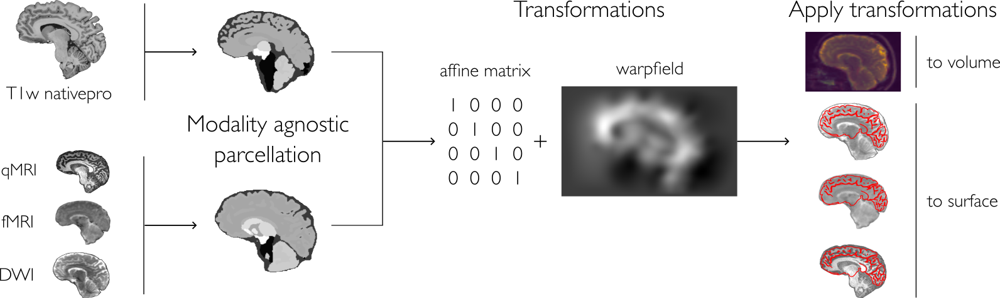

# LAMAR   |   *Label Augmented Modality Agnostic Registration*

<div align="left">
  
 [](https://github.com/MICA-MNI/LaMAR) [](https://github.com/MICA-MNI/LaMAR/issues) [](https://github.com/MICA-MNI/LaMAR/stargazers)
  
</div>

We introduced a novel approach for more accurate registration between modalities. This python based workflow combines deep learning-based segmentation and numerical solutions (ANTs) to generate precise warpfields, even for modalities with low signal-to-noise ratio, signal dropout and strong geometric distortions, such as diffusion MRI and fMRI acquisitions. 



### How to run test

To run the script, use the command line interface here:
```bash
python synthseg_registration.py --input testdata/sub-HC001_ses-01_T1w.nii.gz --reference sub-HC001_ses-02_T1w.nii --output "registered.nii.gz" --workdir workdir
```
### Prerequisites

- Python 3.10

```bash
pip install lamar
```

### References
> 1.	Billot, Benjamin, et al. "Robust machine learning segmentation for large-scale analysis of heterogeneous clinical brain MRI datasets." Proceedings of the National Academy of Sciences 120.9 (2023): e2216399120.
> 1.	Avants, Brian B., Nick Tustison, and Gang Song. "Advanced normalization tools (ANTS)." Insight j 2.365 (2009): 1-35.

